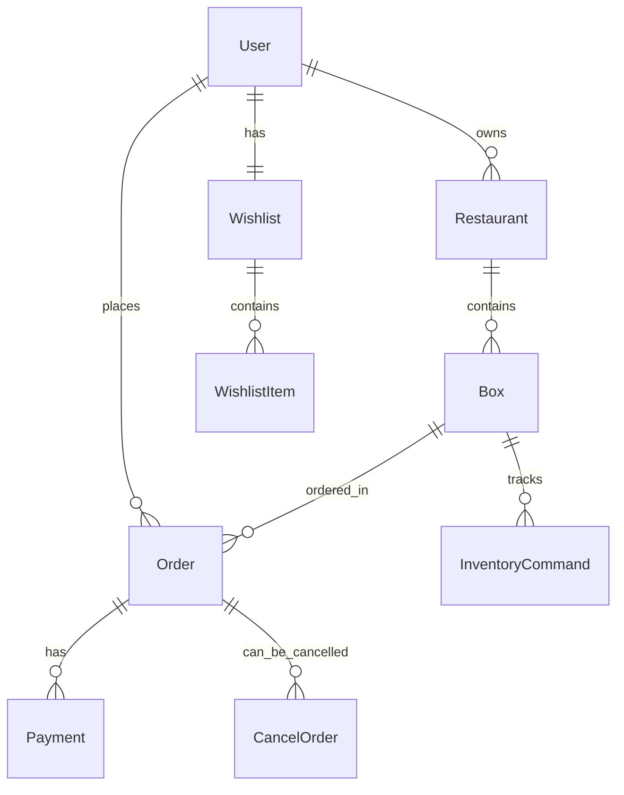

# Domain Models

Complete domain model documentation for the Wyzly Food Delivery Platform.

## 🏗️ Database Architecture

The platform uses a hybrid database approach:
- **PostgreSQL (Prisma)**: Core business data with ACID compliance
- **MongoDB (Mongoose)**: User preferences and flexible data structures

---

## 📊 Entity Relationship Diagram



---

## 🔧 PostgreSQL Models (Prisma)

### User
Core user entity for authentication and profile management.

```typescript
interface User {
  id: number;           // Primary key, auto-increment
  email: string;        // Unique, required, max 255 chars
  username: string;     // Unique, required, max 100 chars
  password: string;     // Hashed with bcrypt, max 255 chars
  role: string;         // "customer" | "admin" | "restaurant_owner", default: "customer"
  phoneNumber?: string; // Optional, max 20 chars
  age?: number;         // Optional integer
  gender?: string;      // Optional, max 10 chars
  address?: string;     // Optional text
  createdAt: DateTime;  // Auto-generated timestamp
  updatedAt: DateTime;  // Auto-updated timestamp
  
  // Relations
  restaurants: Restaurant[];    // One-to-many (as owner)
  orders: Order[];             // One-to-many (as customer)
  cancelOrders: CancelOrder[]; // One-to-many (as requester)
  adminApprovals: CancelOrder[]; // One-to-many (as admin approver)
}
```

**Database Constraints:**
- `email`: UNIQUE INDEX for fast lookups
- `username`: UNIQUE INDEX
- `role`: INDEX for role-based filtering
- Foreign key constraints with CASCADE delete for data integrity

**Business Rules:**
- Email must be valid format
- Password minimum 6 characters (enforced in API)
- Role determines access permissions
- Soft delete approach (keep user records for audit trail)

### Restaurant
Restaurant entity managed by restaurant owners.

```typescript
interface Restaurant {
  id: number;           // Primary key, auto-increment
  name: string;         // Required, max 255 chars
  phoneNumber?: string; // Optional, max 20 chars
  description?: string; // Optional text
  ownerId?: number;     // Foreign key to User.id
  createdAt: DateTime;  // Auto-generated timestamp
  updatedAt: DateTime;  // Auto-updated timestamp
  
  // Relations
  owner?: User;         // Many-to-one relationship
  boxes: Box[];         // One-to-many relationship
}
```

**Business Rules:**
- Must have valid owner (restaurant_owner role)
- Name must be unique per owner
- Cascade delete: boxes deleted when restaurant deleted
- Owner can manage multiple restaurants

### Box
Food item/product entity within restaurants.

```typescript
interface Box {
  id: number;           // Primary key, auto-increment
  title: string;        // Required, max 255 chars
  price: Decimal;       // Required, precision 10,2 (e.g., 999999.99)
  quantity: number;     // Available stock, default: 0
  image?: string;       // Optional image URL, max 500 chars
  restaurantId?: number; // Foreign key to Restaurant.id
  isAvailable: boolean; // Computed: quantity > 0 && manually enabled
  createdAt: DateTime;  // Auto-generated timestamp
  updatedAt: DateTime;  // Auto-updated timestamp
  
  // Relations
  restaurant?: Restaurant;      // Many-to-one relationship
  orders: Order[];             // One-to-many relationship
  inventoryCommands: InventoryCommand[]; // Audit trail
}
```

**Database Constraints:**
- `isAvailable`: INDEX for filtering available items
- `restaurantId`: INDEX for restaurant-specific queries
- Price stored as DECIMAL for precision

**Business Rules:**
- Price must be positive
- Quantity cannot be negative
- `isAvailable` = `quantity > 0 && manually_enabled`
- Image URLs validated for security
- Soft delete: mark as unavailable instead of deletion

### Order
Customer order entity linking users to boxes.

```typescript
interface Order {
  id: number;           // Primary key, auto-increment
  userId?: number;      // Foreign key to User.id
  boxId?: number;       // Foreign key to Box.id
  quantity: number;     // Ordered quantity, must be positive
  totalPrice: Decimal;  // Calculated: box.price * quantity
  status: string;       // "pending" | "confirmed" | "completed" | "cancelled"
  isCancelled: boolean; // Quick filter, default: false
  createdAt: DateTime;  // Auto-generated timestamp
  updatedAt: DateTime;  // Auto-updated timestamp
  
  // Relations
  user?: User;          // Many-to-one relationship
  box?: Box;            // Many-to-one relationship
  payments: Payment[];  // One-to-many relationship
  cancelOrders: CancelOrder[]; // One-to-many for cancellation tracking
}
```

**Database Constraints:**
- `userId`: INDEX for user order history
- `status`: INDEX for status filtering
- `createdAt`: INDEX for chronological sorting
- Cascade delete on user/box deletion

**Business Rules:**
- Order quantity cannot exceed available stock at time of creation
- `totalPrice` calculated and validated server-side
- Status transitions: pending → confirmed → completed
- Cancellation allowed only in pending/confirmed states
- Inventory reduced immediately upon order creation

### Payment
Payment tracking for orders.

```typescript
interface Payment {
  id: number;           // Primary key, auto-increment
  orderId?: number;     // Foreign key to Order.id
  amount: Decimal;      // Payment amount, precision 10,2
  status: string;       // "pending" | "completed" | "failed" | "refunded"
  method: string;       // "mock" | "credit_card" | "paypal" | etc.
  transactionId?: string; // External payment processor ID
  createdAt: DateTime;  // Auto-generated timestamp
  updatedAt: DateTime;  // Auto-updated timestamp
  
  // Relations
  order?: Order;        // Many-to-one relationship
}
```

**Business Rules:**
- Amount must match order total
- Support multiple payment attempts per order
- Transaction ID required for non-mock payments
- Refunds create negative amount entries

### CancelOrder
Order cancellation request and approval tracking.

```typescript
interface CancelOrder {
  id: number;           // Primary key, auto-increment
  orderId?: number;     // Foreign key to Order.id
  userId?: number;      // Foreign key to User.id (requester)
  isApproved?: boolean; // null: pending, true: approved, false: denied
  adminId?: number;     // Foreign key to User.id (approver)
  reason?: string;      // Cancellation reason
  createdAt: DateTime;  // Request timestamp
  approvedAt?: DateTime; // Approval/denial timestamp
  
  // Relations
  order?: Order;        // Many-to-one relationship
  user?: User;          // Many-to-one (requester)
  admin?: User;         // Many-to-one (approver)
}
```

**Business Rules:**
- Customer can cancel own orders
- Admin approval required for some cancellation types
- Inventory restored upon approval
- Refund processed automatically for approved cancellations

### InventoryCommand
Audit trail for inventory changes.

```typescript
interface InventoryCommand {
  id: number;           // Primary key, auto-increment
  type: string;         // "restock" | "reserve" | "release" | "damage"
  boxId?: number;       // Foreign key to Box.id
  quantity: number;     // Change amount (positive or negative)
  previousQuantity: number; // Quantity before change
  createdAt: DateTime;  // Command timestamp
  
  // Relations
  box?: Box;            // Many-to-one relationship
}
```

**Business Rules:**
- Immutable audit log
- Every inventory change must create command
- Supports inventory reconciliation
- Tracks manual adjustments and automated changes

---

## 🍃 MongoDB Models (Mongoose)

### Wishlist
User's wishlist stored in MongoDB for flexibility.

```typescript
interface Wishlist {
  userId: number;       // References PostgreSQL User.id
  items: WishlistItem[]; // Embedded documents
  createdAt: Date;      // Document creation
  updatedAt: Date;      // Document last update
  
  // Instance Methods
  addItem(boxId: number, priority?: string, notes?: string, quantity?: number): Promise<Wishlist>;
  removeItem(boxId: number): Promise<Wishlist>;
  clearWishlist(): Promise<Wishlist>;
  getItemsByPriority(priority: string): WishlistItem[];
  
  // Static Methods
  static findByUserId(userId: number): Promise<Wishlist | null>;
  static createOrUpdateWishlist(userId: number, boxId: number, priority?: string, notes?: string, quantity?: number): Promise<Wishlist>;
}
```

**MongoDB Schema:**
```javascript
{
  userId: { type: Number, required: true, unique: true, index: true },
  items: [WishlistItemSchema],
  createdAt: { type: Date, default: Date.now },
  updatedAt: { type: Date, default: Date.now }
}
```

**Indexes:**
- `userId`: Primary lookup index
- `{ userId: 1, 'items.boxId': 1 }`: Compound index for item operations

### WishlistItem
Embedded document within Wishlist.

```typescript
interface WishlistItem {
  userId: number;       // References PostgreSQL User.id
  boxId: number;        // References PostgreSQL Box.id
  addedAt: Date;        // When item was added
  priority: 'low' | 'medium' | 'high'; // User-defined priority
  notes: string;        // User notes, sentinel value: empty string
  quantity: number;     // Desired quantity, default: 1, min: 1
}
```

**Business Rules:**
- One item per boxId per user (upsert behavior)
- Priority defaults to 'medium'
- Quantity must be positive integer
- Notes limited to 500 characters
- Sentinel values: empty string for missing notes

---

## 🔄 Data Flow Patterns

### Order Creation Flow
1. **Client Request**: User selects box and quantity
2. **Validation**: Check box availability and stock
3. **Inventory Reserve**: Temporarily reduce box quantity
4. **Order Creation**: Create order record with "pending" status
5. **Payment Processing**: Create payment record
6. **Order Confirmation**: Update status to "confirmed"
7. **Inventory Commit**: Finalize inventory reduction

### Wishlist Synchronization
1. **Local Storage**: Client maintains local wishlist
2. **Sync API**: Periodic sync with server
3. **Conflict Resolution**: Server data takes precedence
4. **Population**: Server enriches with current box/restaurant data
5. **Client Update**: Local storage updated with merged data

### Data Consistency
- **PostgreSQL**: ACID compliance for critical business data
- **MongoDB**: Eventual consistency for user preferences
- **Cross-Database**: Manual consistency via application logic
- **Compensation**: Rollback mechanisms for failed cross-database transactions

---

## 🎯 Business Logic Constraints

### Inventory Management
```typescript
// Business rules enforced at application level
class InventoryService {
  // Cannot oversell
  static validateOrderQuantity(boxId: number, requestedQty: number): boolean {
    const availableQty = getBoxQuantity(boxId);
    return requestedQty <= availableQty && requestedQty > 0;
  }
  
  // Atomic inventory operations
  static async reserveInventory(boxId: number, quantity: number): Promise<void> {
    // Use database transactions to ensure atomicity
    await prisma.$transaction(async (tx) => {
      const box = await tx.box.findUnique({ where: { id: boxId } });
      if (!box || box.quantity < quantity) throw new Error('Insufficient inventory');
      
      await tx.box.update({
        where: { id: boxId },
        data: { quantity: box.quantity - quantity }
      });
      
      await tx.inventoryCommand.create({
        data: {
          type: 'reserve',
          boxId: boxId,
          quantity: -quantity,
          previousQuantity: box.quantity
        }
      });
    });
  }
}
```

### Price Calculation
```typescript
// Server-side price calculation (never trust client)
class OrderService {
  static async calculateOrderTotal(boxId: number, quantity: number): Promise<number> {
    const box = await prisma.box.findUnique({ where: { id: boxId } });
    if (!box) throw new Error('Box not found');
    
    return parseFloat(box.price.toString()) * quantity;
  }
}
```

### Access Control
```typescript
// Role-based access control
enum UserRole {
  CUSTOMER = 'customer',
  RESTAURANT_OWNER = 'restaurant_owner',
  ADMIN = 'admin'
}

class AuthService {
  static canManageRestaurant(user: User, restaurantId: number): boolean {
    return user.role === UserRole.ADMIN || 
           (user.role === UserRole.RESTAURANT_OWNER && user.restaurants.some(r => r.id === restaurantId));
  }
  
  static canCancelOrder(user: User, order: Order): boolean {
    return user.role === UserRole.ADMIN || order.userId === user.id;
  }
}
```

---

## 📈 Performance Considerations

### Database Optimization
- **Indexes**: Strategic indexes on frequently queried fields
- **Pagination**: Cursor-based pagination for large datasets
- **Caching**: Redis cache for frequently accessed data
- **Connection Pooling**: Prisma connection pooling for PostgreSQL

### Query Patterns
```typescript
// Efficient order history with relationships
const ordersWithDetails = await prisma.order.findMany({
  where: { userId },
  include: {
    box: {
      include: {
        restaurant: true
      }
    }
  },
  orderBy: { createdAt: 'desc' },
  take: 20,
  skip: page * 20
});

// Optimized wishlist population
const populatedWishlist = await Wishlist.aggregate([
  { $match: { userId } },
  { $unwind: '$items' },
  { $lookup: {
    from: 'postgresql_boxes', // Cross-database lookup
    localField: 'items.boxId',
    foreignField: 'id',
    as: 'boxDetails'
  }}
]);
```

### Data Migrations
- **Schema Evolution**: Prisma migrations for PostgreSQL
- **Document Migrations**: Custom scripts for MongoDB schema changes
- **Data Backfill**: Scripts to populate new fields
- **Zero-Downtime**: Blue-green deployment strategies

---

## 🔒 Security Considerations

### Data Validation
- **Input Sanitization**: All user inputs validated and sanitized
- **SQL Injection**: Prevented by Prisma's query builder
- **NoSQL Injection**: Mongoose schema validation
- **Price Tampering**: Server-side price calculation only

### Privacy Protection
- **PII Encryption**: Sensitive data encrypted at rest
- **Data Minimization**: Only collect necessary user data
- **Retention Policies**: Automatic data purging after defined periods
- **Access Logging**: Audit trail for sensitive data access

### Referential Integrity
```typescript
// Cross-database referential integrity
class DataIntegrityService {
  // Verify PostgreSQL references in MongoDB
  static async validateWishlistItems(wishlist: Wishlist): Promise<boolean> {
    const boxIds = wishlist.items.map(item => item.boxId);
    const existingBoxes = await prisma.box.findMany({
      where: { id: { in: boxIds } }
    });
    
    return boxIds.length === existingBoxes.length;
  }
  
  // Clean up orphaned MongoDB documents
  static async cleanupOrphanedWishlists(): Promise<void> {
    const wishlists = await Wishlist.find({});
    const userIds = wishlists.map(w => w.userId);
    const existingUsers = await prisma.user.findMany({
      where: { id: { in: userIds } }
    });
    
    const orphanedWishlists = wishlists.filter(w => 
      !existingUsers.some(u => u.id === w.userId)
    );
    
    await Wishlist.deleteMany({
      _id: { $in: orphanedWishlists.map(w => w._id) }
    });
  }
}
```

---

This domain model documentation provides the foundation for understanding the Wyzly platform's data architecture, business rules, and implementation patterns.